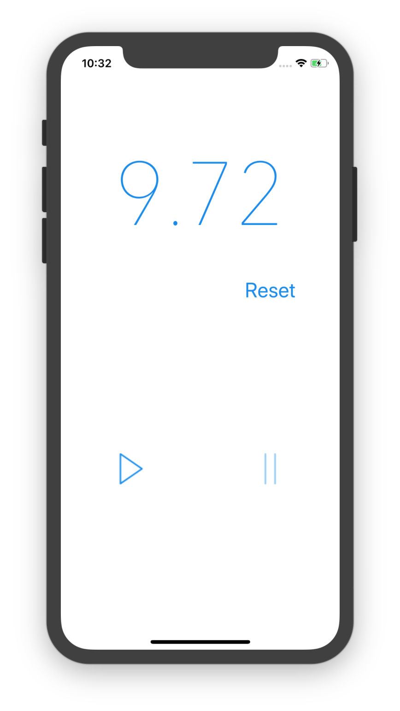

# iOS_StopWathc-master
## 文件结构
```
.
├── .DS_Store
├── .git
│   ├── COMMIT_EDITMSG
│   ├── HEAD
│   ├── branches
│   ├── config
│   ├── description
│   ├── hooks
│   │   ├── README.sample
│   │   ├── applypatch-msg.sample
│   │   ├── commit-msg.sample
│   │   ├── fsmonitor-watchman.sample
│   │   ├── post-update.sample
│   │   ├── pre-applypatch.sample
│   │   ├── pre-commit.sample
│   │   ├── pre-push.sample
│   │   ├── pre-rebase.sample
│   │   ├── pre-receive.sample
│   │   ├── prepare-commit-msg.sample
│   │   └── update.sample
│   ├── index
│   ├── info
│   │   └── exclude
│   ├── logs
│   │   ├── HEAD
│   │   └── refs
│   │       └── heads
│   │           └── master
│   ├── objects
│   │   ├── 03
│   │   │   └── c13c2286150ad7416086bec99d2c46ccca6efc
│   │   ├── 16
│   │   │   └── be3b681122de83e380d47b840b7d0486f71f86
│   │   ├── 18
│   │   │   └── d981003d68d0546c4804ac2ff47dd97c6e7921
│   │   ├── 1f
│   │   │   └── 615f39e41ec8333d22ca907fc1c148148a8057
│   │   ├── 26
│   │   │   └── ad73ac1bc228907f91b80c59a84d0af314e912
│   │   ├── 27
│   │   │   └── 08767942efb50b50b9a3c79288121cd70a2a9f
│   │   ├── 2d
│   │   │   └── 3348d87704fa6b151e425325bd52055b823c47
│   │   ├── 30
│   │   │   └── bd92157012755a0e12a7dfa666665d2485eab9
│   │   ├── 33
│   │   │   └── de86599d1e61f3ee5fba93a8688430ea54b052
│   │   ├── 8c
│   │   │   └── 701bdcad01f80f25361ab6e41aa7c055d8c82b
│   │   ├── a4
│   │   │   └── 71946f9a2daa98d342937bf16e9be0856f8345
│   │   ├── a7
│   │   │   └── 39ce538e209fae66dea9997461639334c4c5d9
│   │   ├── ae
│   │   │   └── d217b248a06760c0ad4bedc2234d907883f9b9
│   │   ├── b3
│   │   │   ├── 1d211c012d9fc079e864d622e28be6689a948d
│   │   │   └── 38e7f218403e208e432d6b3629db6ef35da1f4
│   │   ├── c4
│   │   │   └── 3cc9b8ba4e4ae5c6df5ed5e3f199668b7fead0
│   │   ├── c7
│   │   │   └── aa08df9d95e535f8c489eacd7c95878d37b4f8
│   │   ├── d8
│   │   │   └── db8d65fd79fd541b2b7eba75c7378af3448f9c
│   │   ├── da
│   │   │   └── 4a164c918651cdd1e11dca5cc62c333f097601
│   │   ├── e5
│   │   │   └── 4e30270e9566df8c8d9a7cec8c266cdcd462b9
│   │   ├── e7
│   │   │   └── 7a3dcb33354e152956297639f10f793443466a
│   │   ├── ef
│   │   │   └── 946ad780b573fe586624f5ab142a2e2bdfecd0
│   │   ├── f3
│   │   │   └── 93f2d81f7289e07dbc619831e4ed59df45e816
│   │   ├── f8
│   │   │   └── 3f6fd5810b9c852cf98563d82d5ed1e84ff893
│   │   ├── info
│   │   └── pack
│   └── refs
│       ├── heads
│       │   └── master
│       └── tags
├── .idea
│   ├── StopWatch.iml
│   ├── inspectionProfiles
│   │   └── profiles_settings.xml
│   ├── misc.xml
│   ├── modules.xml
│   └── workspace.xml
├── README.md                       # 本案
├── StopWatch
│   ├── AppDelegate.swift           # 项目设置
│   ├── Assets.xcassets
│   │   ├── .DS_Store
│   │   ├── AppIcon.appiconset
│   │   │   └── Contents.json
│   │   ├── Contents.json
│   │   ├── pause.imageset          # 暂停图标
│   │   │   ├── .DS_Store
│   │   │   ├── Contents.json
│   │   │   └── pause.png
│   │   └── play.imageset           # 开始/继续图标
│   │       ├── Contents.json
│   │       └── play.png
│   ├── Base.lproj
│   │   ├── LaunchScreen.storyboard
│   │   └── Main.storyboard         # 面板 UI 布置文件
│   ├── Info.plist
│   └── ViewController.swift
├── StopWatch.xcodeproj             # 项目根文件
│   ├── project.pbxproj
│   ├── project.xcworkspace
│   │   ├── contents.xcworkspacedata
│   │   ├── xcshareddata
│   │   │   └── IDEWorkspaceChecks.plist
│   │   └── xcuserdata
│   │       └── lightwingng.xcuserdatad
│   │           └── UserInterfaceState.xcuserstate
│   └── xcuserdata
│       └── lightwingng.xcuserdatad
│           └── xcschemes
│               └── xcschememanagement.plist
└── StopWatchDemo.png               # 模拟器截图
```
## 运行效果（iPhone X）

<center>Stop Watch on run</center>

